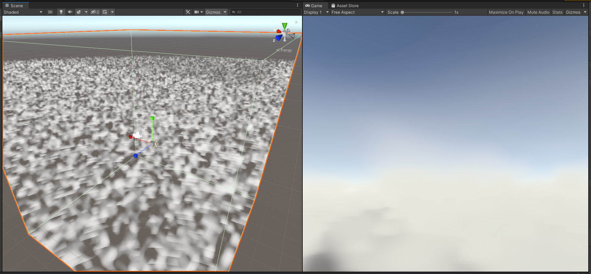
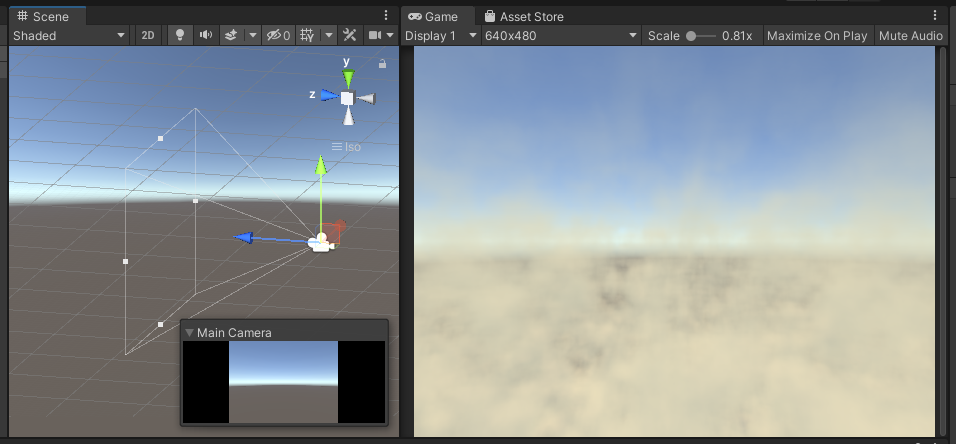

# udemy_shaderdev_volumetric

## Lesson 58. Ray Marching

Shader code [HolisticSphere.shader](HolisticSphere.shader)

## Lesson 59. More on Ray Marching

Shader code [HolisticSphereLambertLit.shader](HolisticSphereLambertLit.shader)

## Lessons 60, 61, 62. Spherical Fog Density

Shader code [HolisticSphereFog.shader](HolisticSphereFog.shader)

## Lessons 63, 64, 65, 66, 67 Noise and clouds

Shader code [HolisticRaymarchClouds.shader](HolisticRaymarchClouds.shader)

## Lessons 68, 69, 70, 71, 72 Clouds on camera

Shader code [HolisticCloudsCameraWithPlasma.shader](HolisticCloudsCameraWithPlasma.shader)

C# camera code [Clouds.cs](Clouds.cs)

There is a lot of "try to guess the number" work involved. You will achieve a different results with different noise textures even if they looks very similar. You also get different result on liner and gamma project setup. So, I just leave these materials as they are. A screenshot was taken from 2020.3.6f1 version of Unity with gamma setup and sRGB option enabled on noise texture import.
