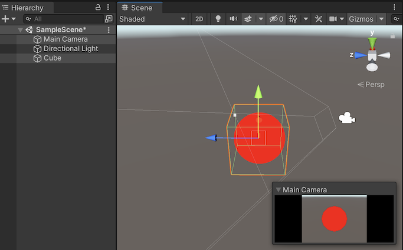
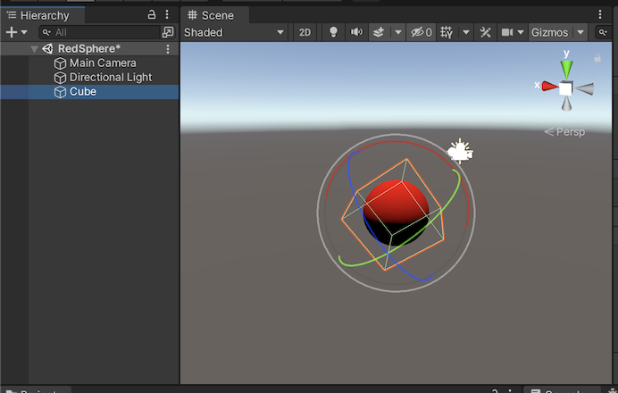

# udemy_shaderdev_volumetric

## Lesson 58. Ray Marching

Shader code [HolisticSphere.shader](HolisticSphere.shader)

## Lesson 59. More on Ray Marching

Shader code [HolisticSphereLambertLit.shader](HolisticSphereLambertLit.shader)

